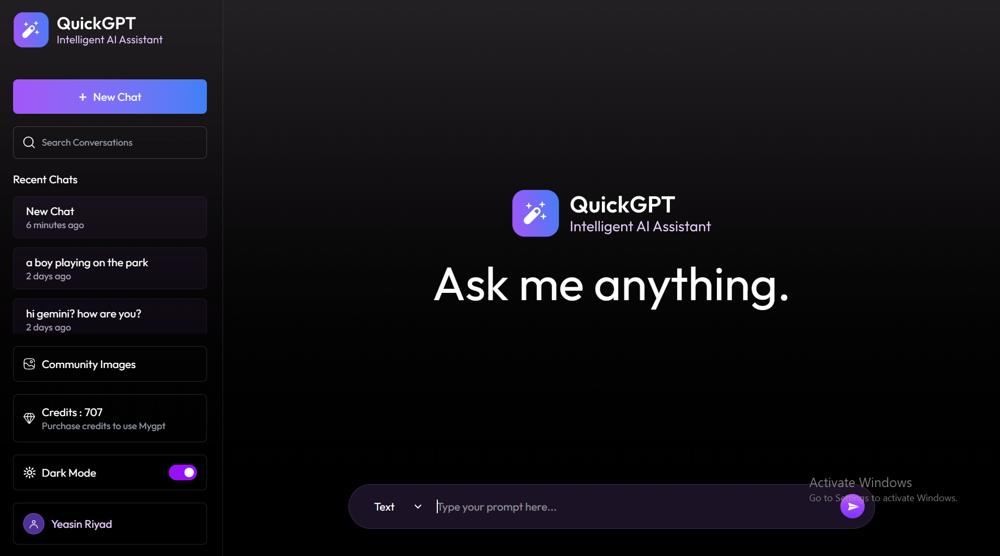
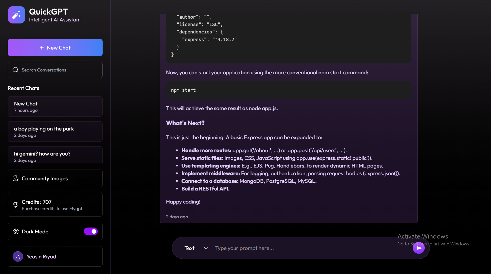
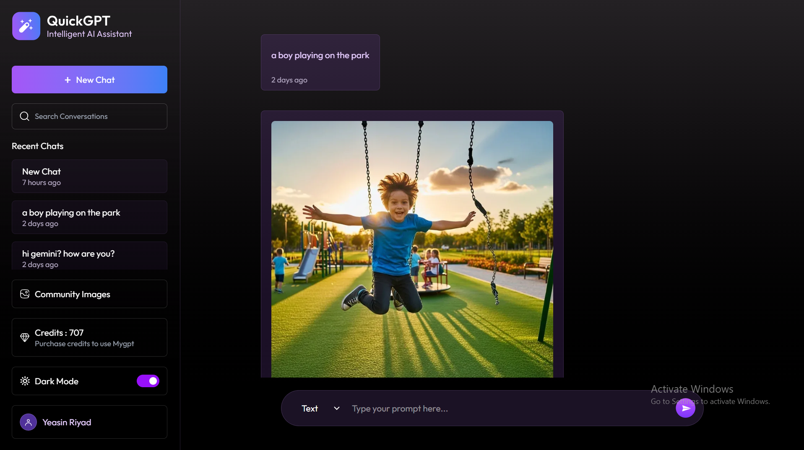
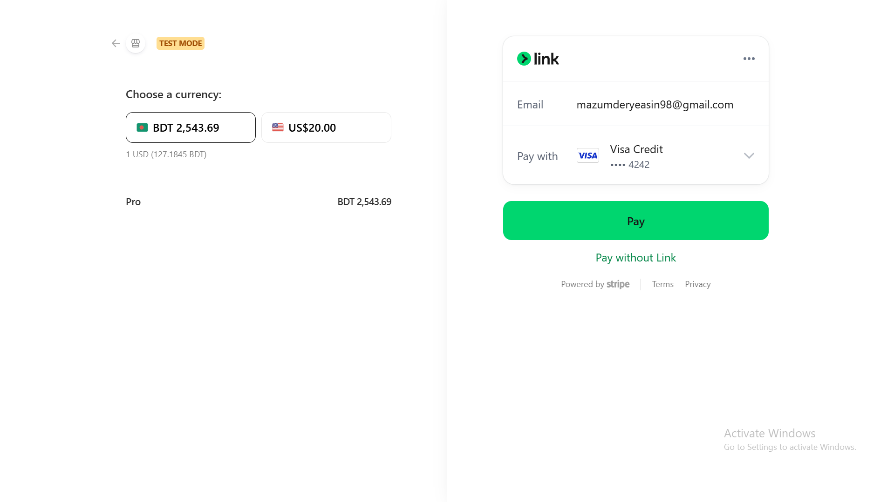

# 🤖⚡ AI Chatbot – Full Stack MERN Project

> **Build a powerful, modern, and intelligent AI Chatbot like ChatGPT & Google Gemini using the MERN Stack + AI + Image Generation + Online Payments**

---

## 🌟 Project Overview

Welcome to an **AI-powered Full Stack Chatbot Application** built with the **MERN Stack (MongoDB, Express.js, React.js, Node.js)** that lets users:

* ✨ Generate **AI text responses** using **Google Gemini & OpenAI**
* 🎨 Create **AI-generated images** from text prompts using **ImageKit**
* 🔐 **Sign up & log in securely**
* 💳 **Buy credits using an online payment gateway**
* ☁️ **Use the app online like a real SaaS product**

This project is designed to feel like a **real-world production-ready AI platform** — fast, beautiful, scalable, and powerful.

---

## 🚀 Live Experience

* Chat with AI in real time
* Generate stunning AI images
* Track remaining credits
* Purchase more credits instantly

---

## 🧠 Core Features

### 🔐 Authentication System

* User Registration & Login
* Secure JWT-based authentication
* Protected routes for AI features

### 💬 AI Text Generation

* Powered by **Google Gemini AI**
* Integrated with **OpenAI React Package**
* Supports long-form responses & conversational flow

### 🎨 AI Image Generation

* Generate images from text prompts
* Powered by **ImageKit**
* Fast cloud delivery and optimized rendering

### 💳 Credit-Based Payment System

* Buy AI credits online
* Secure payment gateway integration
* Real-time credit balance tracking

### 📊 Dashboard

* View usage history
* Credit balance
* Generated text & images
* 
---

## 🛠️ Tech Stack

### Frontend

* ⚛️ **React.js**
* 🎨 Tailwind CSS
* 🔄  Axios
* 🔐 JWT Authentication

### Backend

* 🟢 **Node.js**
* 🚂 **Express.js**
* 🗄️ **MongoDB**

### AI & Media

* 🧠 **Google Gemini AI Model**
* 🤖 **OpenAI React SDK**
* 🖼️ **ImageKit (AI Image Generation & CDN)**

### Payments

* 💳 Online Payment Gateway (Stripe)

---

## 📸 Screenshots

---

## 🔥 Future Enhancements

* 🧠 Chat Memory System
* 📱 Mobile App Version (React Native)
* 🗣️ Voice Input & Output
* 🧾 Invoice System for Payments
* 👥 Team & Organization Accounts

---

## 🛡️ Security

* Environment variables for sensitive keys
* JWT protected routes
* Server-side payment verification

---

## 🏆 Why This Project is Special

This is not just a chatbot — it’s a **real SaaS-style AI platform**

---

## 🤝 Contributing

Contributions are welcome! Feel free to:

* Fork the repo
* Create a feature branch
* Submit a pull request

---

## ❤️ Credits

Built with passion using:

* Google Gemini AI
* OpenAI
* ImageKit
* MERN Stack

---

## 📬 Contact

If you have any questions or ideas:

> ✉️ Email:(mazumderyeasin98@gmail.com)

---

> ⚡ **Turn your ideas into AI-powered reality. Happy Coding!** 🚀
